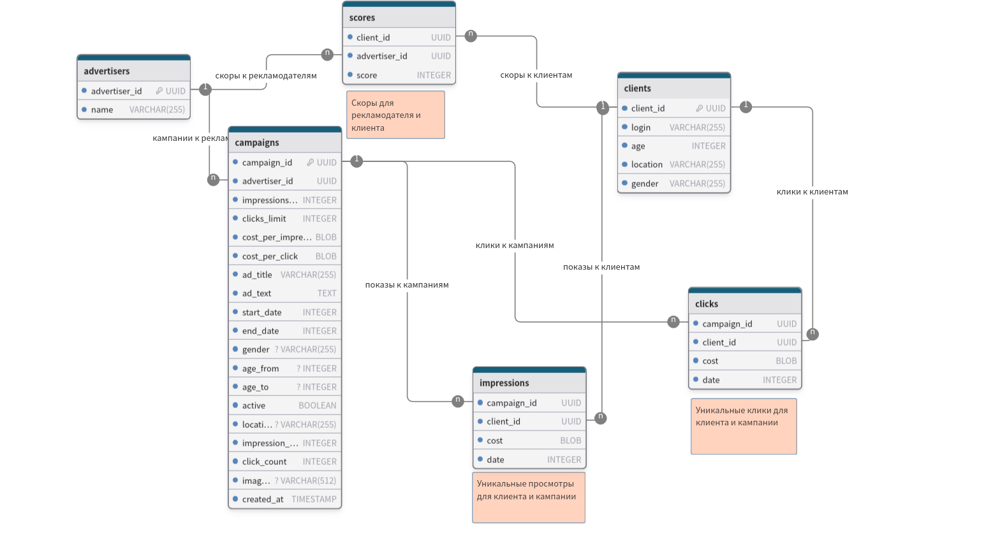
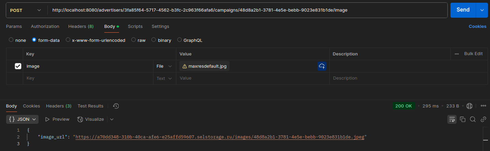
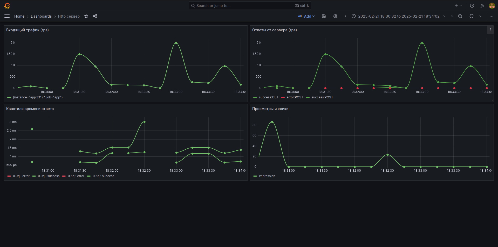
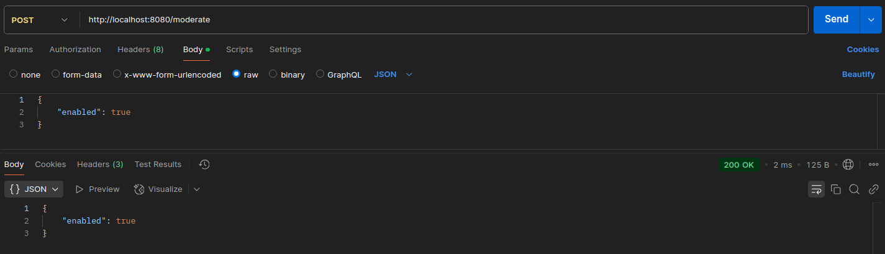
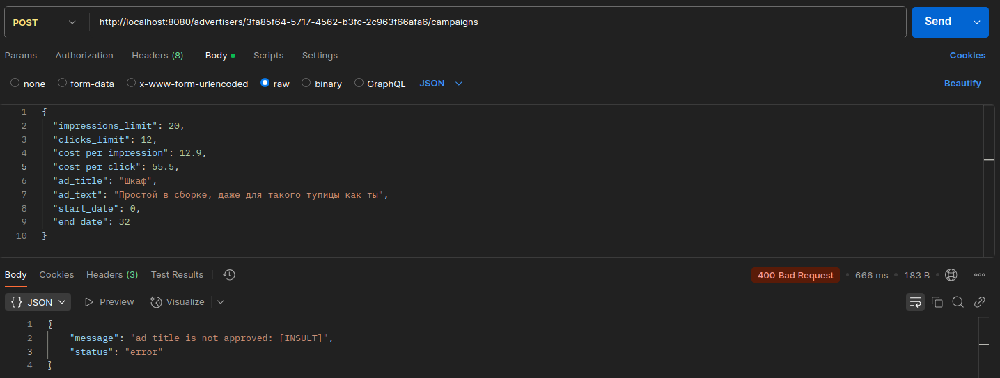
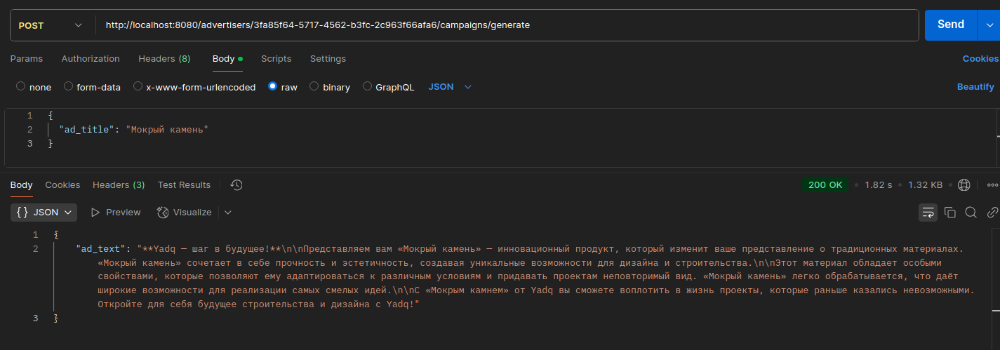

# Рекламная платформа

## Запуск приложения

Приложение запускается через docker compose файл в директории solution - docker compose up

### Сервисы docker compose

- **Postgres**: В качестве основной базы данных
- **Redis**: Для хранения информации о дате в системе
- **Prometheus**: Используется для сбора метрик
- **Grafana**: Используется для построения графиков на основе данных из Prometheus
- **App**: Сам Rest Api сервер

После запуска приложения вам станут доступны порты

- **8080**: Rest Api
- **3000**: Grafana

## Сценарии использования

* ###  Создание рекламной кампании
  1. Регистрация рекламодателей по **POST /advertisers/bulk**
  2. Создание рекламной кампании через **POST /advertiser{advertiserId}/campaigns**
   ---
* ### Взаимодействие клиента с рекламой
  1. Регистрация клиентов по **POST /clients/bulk**
  2. Просмотр рекламы **GET /ads?client_id={client_id}**
  3. Клик по рекламе **POST /ads/{adId}/click**
    ---
* ### Просмотр статистики
    Для просмотра статистики существует ряд эндпоинтов
    1. **/stats/campaigns/{campaignId}** - Получение статистики по рекламной кампании
    2. **/stats/advertisers/{advertiserId}/campaigns** - Получение агрегированной статистики по всем кампаниям рекламодателя
    3. **/stats/campaigns/{campaignId}/daily** - Получение ежедневной статистики по рекламной кампании
    4. **/stats/advertisers/{advertiserId}/campaigns/daily** - Получение ежедневной агрегированной статистики по всем кампаниям рекламодателя
---
## Схема данных

---
## Изображения в рекламный объявлениях

Для хранения изображений используется Selectel S3. Чтобы сохранить фото нужно отправить запрос к **POST /advertisers/{advertiser_id}/campaigns/{campaign_id}/image** и загрузить фото для image в form-data. Поддерживаемые форматы: *.jpeg*, *.png*, *.jpg*

---
## Визуализация статистики
Для просмотра метрик развернута Grafana на **3000** порту. Логин: admin пароль: admin

---
## Модерация текстов рекламных кампаний
Для модерации используется [Perspective Comment Analyzer API](https://www.perspectiveapi.com/). Модерация отключена по умолчанию. Для включения нужно обратиться к **POST /moderate** с указанием статуса **enabled** в теле

---

---
## Интеграция с LLM для генерации рекламных текстов
Используется [YandexGPT API](https://yandex.cloud/ru/services/yandexgpt). Для генерации нужно текста отправить запрос к **POST /advertisers/{advertiser_id}/campaigns/generate**, указав **ad_title** в теле запроса. При генерации текста будет учтено название рекламы и рекламодателя

---
## Тестирование
Есть unit и e2e тесты. Для запуска e2e тестов можно прописать make test.integration. Тесты разделены по группам, перед каждой группой тестов приложнеие полностью перезагружается. Также в тестах api сервер может перезапускаться.